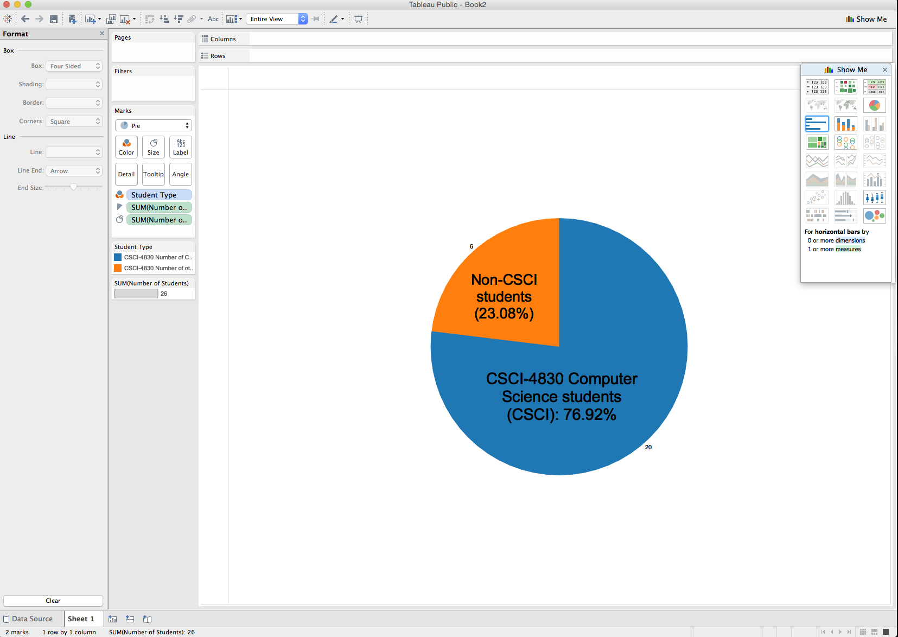
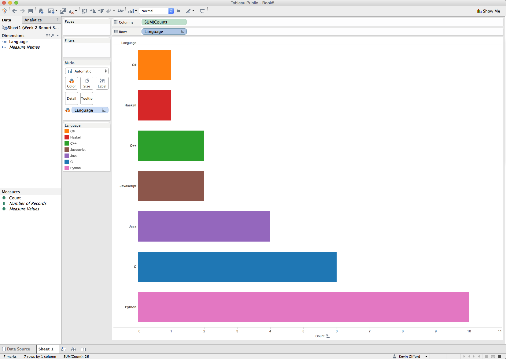
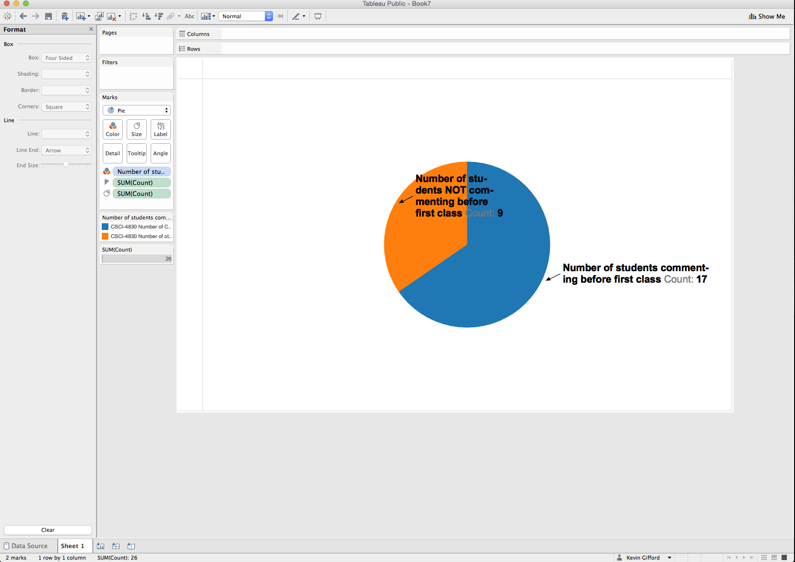
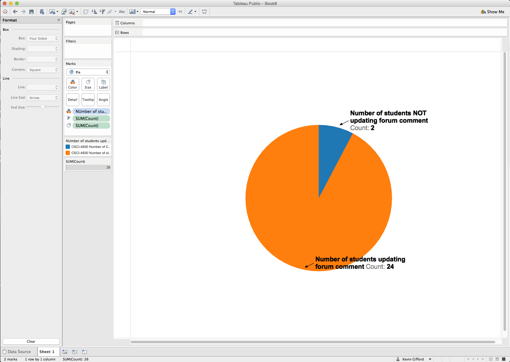

# Tableau Visualization

Tableau is arguably the biggest deal now in terms of data visualization for non-programmers.
Let's pretend you are not a programer. Learn and experience what it is like to make
visualizations using Tableau to answer the same questions about your classmates in our course.

For each of the question, think about what chart you should use to convey your answer and
make your best effort to create something that makes sense to you. There's no right
or wrong. When we meet in the class again, we will set aside time for each team to discuss
and compare the variety of visualization solutions each member has come up with for the
same set of questions. It will be fun!

To include a Tableau visualization in your report, take a screenshot, save it as an image,
put it in the `learning/week2` folder, and replace ``  with
your own image. Please makes sure your screenshot includes the _entire_ Tableau interface
including the controls, widgets ...etc.

# How big the deal Tableau really is?

(write your answer based on the statistics you can find online)

CreativeBlog.com has a nice write-up on visualization packages at: http://www.creativebloq.com/design-tools/data-visualization-712402

Computer World has a very nice summary table (includes Tableau) of data visualization packages at: http://www.computerworld.com/article/2506820/business-intelligence/business-intelligence-chart-and-image-gallery-30-free-tools-for-data-visualization-and-analysis.html

There is a nice data visualization tools comparison (includes tableau) at: http://www.softwareadvice.com/bi/data-visualization-comparison/?layout=var_p1

If you do a google search on "data visualization tools comparison" it is interesting to note that Tableua is mentioned in most every article.  Plus Tableau is free so that is great - seems like a good tool!

# What percentage of the class are Computer Science students?

The Tableau pie chart (above) shows the percentage of Computer Science (major and/or minor) in the Fall 2015 CSCI-4830 class.

# What are the favorite programming languages for the class participants?

The Tableau bar chart (above) shows the favorite language preference of the Fall 2015 CSCI-4830 class.  Python ranked the highest (we'll see if this changes following the completion of this class)

# # How many students commented on the Introduction Issue before the first class?

The pie chart above shows that for the Fall 2015 CSCI-4830 class 17 students commented on the class forum prior to the start of class and 9 students commented afterwards.

# How many students have updated their initial Introduction comments?

The pie chart above shows that 2 of the Fll 2015 CSCI students updated their comment while 24 did not.
