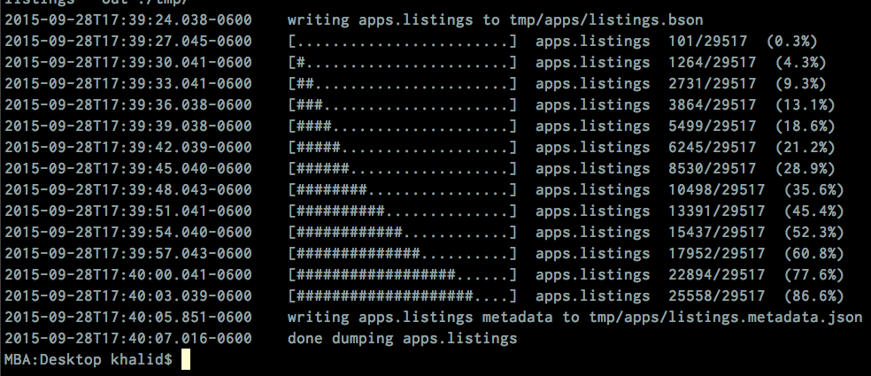
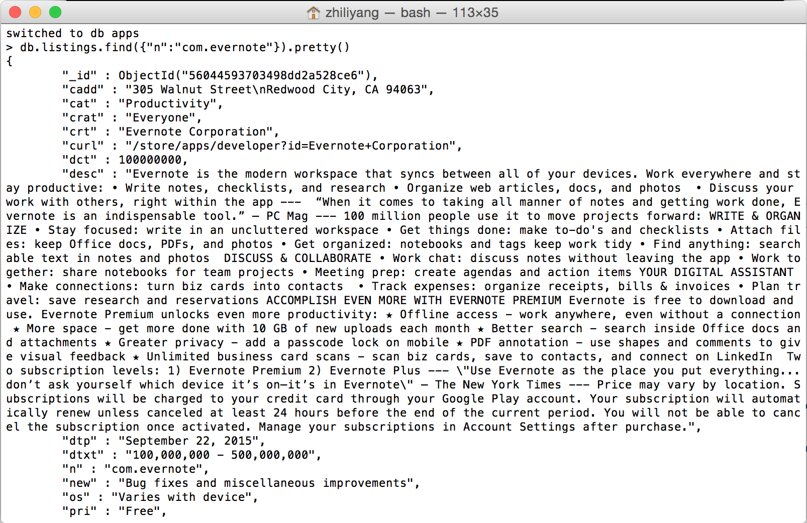

# Setup

The objective of this part of the learning challenge is to
download and install a Mongodb server running on your local machine and has the
server populated with the Android App listing detail data.

## Install

## Export Data

You can obtain data from an existing Mongodb server we've already setup. The information
about this server are provided below:

- host: ds041663.mongolab.com
- port: 41663
- user name: bigdatahci
- password: bigdatahci2015
- db: apps
- collection: listings

Read the documentation to figure out what command to run in order to _dump_
all the data into a file: [mongodump](http://docs.mongodb.org/manual/reference/program/mongodump/).
This is a part of the challenge to see if you can rely on online documentation to
learn how to write appropraite database commands to do what you want.

This server has been configured to be read-only so you don't have to worry about
accidentally wiping the data off this server.

While the data is dumping, you should see something similar to this


## Import Data

Then, you can get this data into your own Mongodb server using the restore command.
Read the documentation to figure out what command to run: [mongorestore](http://docs.mongodb.org/manual/reference/program/mongorestore/).

While the data is being restored, you should see this


## Command-line Interface

Connect to Mongodb through the command line interface.

Issue a query:
```
    db.listings.find({"n":"com.evernote"}).pretty()
```
The goal is to be able to see something like below in the terminal.



(Replace this screenshot with a screenshot of each individual's own computer.
 Include the entire desktop in the screenshot so we can know this screenshot
 does belong to an individual)
